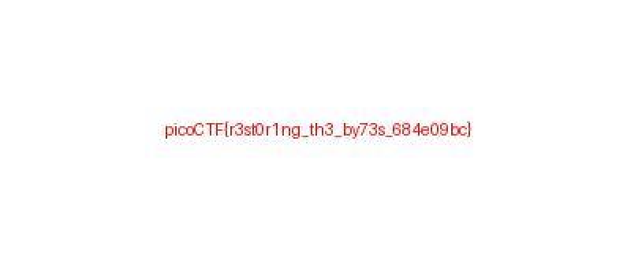

### JPEG Magic Number問題

fileをfile.jpgに名前変更

▶ xxd  ~/Downloads/file.jpg | head        
00000000: 5c78 ffe0 0010 4a46 4946 0001 0100 0001  \x....JFIF......
00000010: 0001 0000 ffdb 0043 0008 0606 0706 0508  .......C........
00000020: 0707 0709 0908 0a0c 140d 0c0b 0b0c 1912  ................
00000030: 130f 141d 1a1f 1e1d 1a1c 1c20 242e 2720  ........... $.' 
00000040: 222c 231c 1c28 3729 2c30 3134 3434 1f27  ",#..(7),01444.'
00000050: 393d 3832 3c2e 3334 32ff db00 4301 0909  9=82<.342...C...
00000060: 090c 0b0c 180d 0d18 3221 1c21 3232 3232  ........2!.!2222
00000070: 3232 3232 3232 3232 3232 3232 3232 3232  2222222222222222
00000080: 3232 3232 3232 3232 3232 3232 3232 3232  2222222222222222
00000090: 3232 3232 3232 3232 3232 3232 3232 ffc0  22222222222222..

▶ hexedit ~/Downloads/file                
hexedit: /Users/ozaki/Downloads/file: Not a file.
▶ hexedit ~/Downloads/file.jpg                                                                                 

マジックナンバーを編集

▶ xxd  ~/Downloads/file.jpg | head
00000000: ffd8 ffe0 0010 4a46 4946 0001 0100 0001  ......JFIF......
00000010: 0001 0000 ffdb 0043 0008 0606 0706 0508  .......C........
00000020: 0707 0709 0908 0a0c 140d 0c0b 0b0c 1912  ................
00000030: 130f 141d 1a1f 1e1d 1a1c 1c20 242e 2720  ........... $.' 
00000040: 222c 231c 1c28 3729 2c30 3134 3434 1f27  ",#..(7),01444.'
00000050: 393d 3832 3c2e 3334 32ff db00 4301 0909  9=82<.342...C...
00000060: 090c 0b0c 180d 0d18 3221 1c21 3232 3232  ........2!.!2222
00000070: 3232 3232 3232 3232 3232 3232 3232 3232  2222222222222222
00000080: 3232 3232 3232 3232 3232 3232 3232 3232  2222222222222222
00000090: 3232 3232 3232 3232 3232 3232 3232 ffc0  22222222222222..

file開く

でもこのFlagではクリアできないみたい。。。