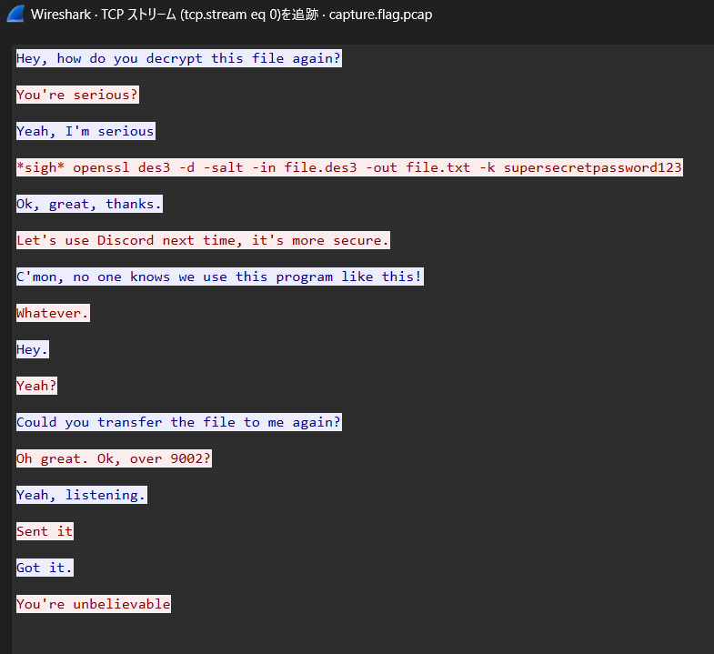
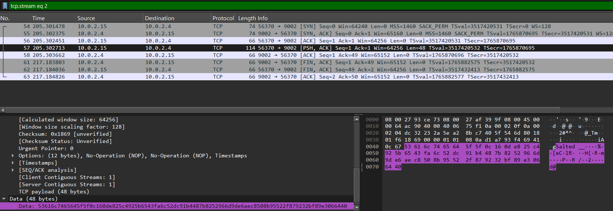

# picoCTF Writeup: Eavesdrop

この問題は、パケットキャプチャから通信内容を読み取り、
送信された暗号ファイルを抽出し、チャットで共有されていた
パスワードと暗号方式を元に復号することでflagを回収する問題です。

- ジャンル: Forensics
- 難易度: Medium

## Writeup

問題文
>Download this packet capture and find the flag.
パケットキャプチャファイルをダウンロードしてflagを見つけてね。

パケットキャプチャファイルをダウンロードして`Wireshark`🦈で開きます。

[分析]タブから[追跡] - [TCPストリーム]を確認します。



なんだかチャットのやり取りが見えます。
赤文字の人が、ファイルの復号方法の確認と9002ポートにファイル転送してほしいと言っていますね。

9002ポートのパケットをみると

`Salted__`から始まるデータを受信していることがわかります。

ファイルの先頭が `Salted__` となっているのは、OpenSSL で `enc -salt` を使って暗号化されたデータの特徴的なヘッダらしいです。

Data部を右クリックして、[パケットバイト列をエクスポート]を選択します。
今回は`file.raw`で保存しました。

今回の問題ではチャットのやり取りから、対象ファイルが`DES3`という暗号アルゴリズムで暗号化されていることがわかります。

`openssl enc`コマンドとチャットの情報から復号を試します。

```
$ openssl enc -d -des3 -salt -in /tmp/file.raw -out /tmp/file.txt -k supersecretpassword123
*** WARNING : deprecated key derivation used.
Using -iter or -pbkdf2 would be better
```
`enc -d -des3 -salt` … DES3 + salt で暗号化された OpenSSL データを復号するオプション

```
$ cat /tmp/file.txt 
picoCTF{nc_73115_411_XXXXXXXX}
```
flagがとれました。（flagはマスクしています。）