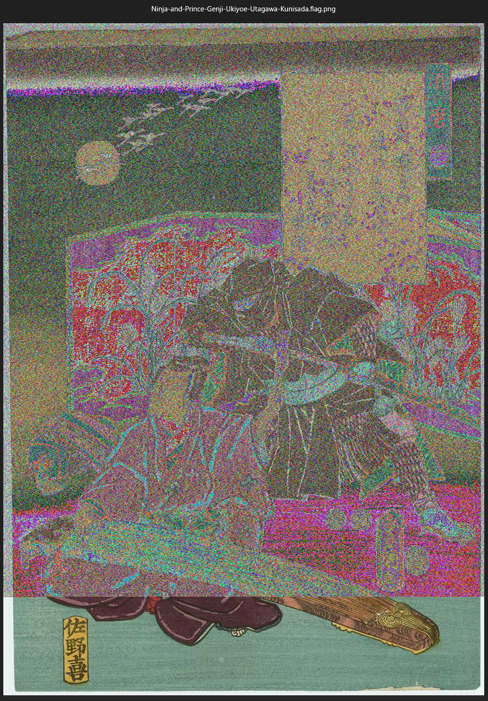

# picoCTF Writeup: MSB

**MSB**を知ろう問題

- ジャンル: Forensics
- 難易度: Medium

## Writeup

問題文
>This image passes LSB statistical analysis, but we can't help but think there must be something to the visual artifacts present in this image...
>Download the image here
>この画像はLSB静的解析をパスしましたが、画像の表示に何か問題があるような。。。
>こちらの画像をダウンロードしてね。

画像をダウンロードします。
```
$ curl -O https://artifacts.picoctf.net/c/304/Ninja-and-Prince-Genji-Ukiyoe-Utagawa-Kunisada.flag.png
```

まずは画像ファイルを開いてみますかね。

これは、歌川 国貞さんの浮世絵らしいです。
上から8割程度フィルターがかかっているような感じですね。

`file`, `exiftool`でファイルを確認します。
```
┌──(ozaki㉿kali)-[/tmp]
└─$ file Ninja-and-Prince-Genji-Ukiyoe-Utagawa-Kunisada.flag.png 
Ninja-and-Prince-Genji-Ukiyoe-Utagawa-Kunisada.flag.png: PNG image data, 1074 x 1500, 8-bit/color RGB, non-interlaced
                                                                                        
┌──(ozaki㉿kali)-[/tmp]
└─$ exiftool Ninja-and-Prince-Genji-Ukiyoe-Utagawa-Kunisada.flag.png 
ExifTool Version Number         : 13.25
File Name                       : Ninja-and-Prince-Genji-Ukiyoe-Utagawa-Kunisada.flag.png
Directory                       : .
File Size                       : 3.4 MB
File Modification Date/Time     : 2025:12:11 11:01:24+09:00
File Access Date/Time           : 2025:12:11 11:01:30+09:00
File Inode Change Date/Time     : 2025:12:11 11:01:24+09:00
File Permissions                : -rw-rw-r--
File Type                       : PNG
File Type Extension             : png
MIME Type                       : image/png
Image Width                     : 1074
Image Height                    : 1500
Bit Depth                       : 8
Color Type                      : RGB
Compression                     : Deflate/Inflate
Filter                          : Adaptive
Interlace                       : Noninterlaced
Image Size                      : 1074x1500
Megapixels                      : 1.6
```
ただのPNGイメージってだけですね。

今回の問題のタイトルの**MSB**について調べます。

[Wikipedia](https://ja.wikipedia.org/wiki/%E6%9C%80%E4%B8%8A%E4%BD%8D%E3%83%93%E3%83%83%E3%83%88)から抜粋
>最上位ビット(さいじょういビット、most significant bitまたはhigh-order bit、MSBと略記)は、コンピュータにおいて二進数で最も大きな値を意味するビット位置のことである。

画像ファイルはRGBをそれぞれ8bitで表現していて、MSBは例えばRの8bitの一番左にあります。
MSBが変わるとRがどーんと濃くなったり薄くなったりします。
だから、画像ファイルの見た目に影響が大きいということですね。

今回の問題はどういうアプローチでいこうか。。。
MSBを抽出して並べるとASCIIのフラグになっているのか？
MSBを正しく復元したら画像にフラグが表示されるのか？

まずはMSBを抽出してみてみましょう。

python3スクリプトを書きます。
まず、pythonの仮想環境を作ります。
`pillow`という**画像処理ライブラリ**を入れます。
```
┌──(ozaki㉿kali)-[/tmp]
└─$ mkdir msb_stego
                                                                                        
┌──(ozaki㉿kali)-[/tmp]
└─$ cd msb_stego 
                                                                                        
┌──(ozaki㉿kali)-[/tmp/msb_stego]
└─$ pwd                
/tmp/msb_stego
                                                                                        
┌──(ozaki㉿kali)-[/tmp/msb_stego]
└─$ python3 -m venv venv
                                                                                        
┌──(ozaki㉿kali)-[/tmp/msb_stego]
└─$ source venv/bin/activate
                                                                                        
┌──(venv)─(ozaki㉿kali)-[/tmp/msb_stego]
└─$ pip install Pillow  
Collecting Pillow
  Downloading pillow-12.0.0-cp313-cp313-manylinux_2_27_x86_64.manylinux_2_28_x86_64.whl.metadata (8.8 kB)
Downloading pillow-12.0.0-cp313-cp313-manylinux_2_27_x86_64.manylinux_2_28_x86_64.whl (7.0 MB)
   ━━━━━━━━━━━━━━━━━━━━━━━━━━━━━━━━━━━━━━━━ 7.0/7.0 MB 4.6 MB/s eta 0:00:00
Installing collected packages: Pillow
Successfully installed Pillow-12.0.0
                                                                                        
┌──(venv)─(ozaki㉿kali)-[/tmp/msb_stego]
└─$ pip list          
Package Version
------- -------
pillow  12.0.0
pip     25.1.1
```
以下がスクリプトです。
```
$ cat extract_msb.py    
from PIL import Image

img = Image.open("Ninja-and-Prince-Genji-Ukiyoe-Utagawa-Kunisada.flag.png").convert("RGB")

w, h = img.size
bits = ""
result = []

for y in range(h):
    for x in range(w):
        r, g, b = img.getpixel((x,y))
        
        # R, G, B の MSB を取り出す（各1ビット）
        for c in (r, g, b):
            bit = (c >> 7) & 1
            bits += str(bit)

            if len(bits) == 8:
                result.append(chr(int(bits, 2)))
                bits = ""

out = ''.join(result)
print(out)
```
私は普段**ビット演算**を使わないので`bit = (c >> 7) & 1`なんて書き方知らなかったのですが、`for`をネストしてるし計算量をなるべく抑えるために、ビット演算にするのがCTFでは定番らしいです。（ChatGPTさん）


さて実行してみますか。出力が長いので`head`してます。
```
$ python3 extract_msb.py | head  
The Project Gutenberg eBook of The History of Don Quixote, by Miguel de Cervantes

This eBook is for the use of anyone anywhere in the United States and
most other parts of the world at no cost and with almost no restrictions
whatsoever. You may copy it, give it away or re-use it under the terms
of the Project Gutenberg License included with this eBook or online at
www.gutenberg.org. If you are not located in the United States, you
will have to check the laws of the country where you are located before
using this eBook.
```
ドン・キホーテのeBookが入っているではないですか！

そんなことより、flagをgrepします。
```
└─$ python3 extract_msb.py | grep pico
picoCTF{15_y0ur_que57_qu1x071c_0r_h3r01c_XXXXXXXX}
```
flagとれました。（flagはマスクしています。）

なんで歌川 国貞とドン・キホーテなんだろう？
気になって今日もよく眠れる。