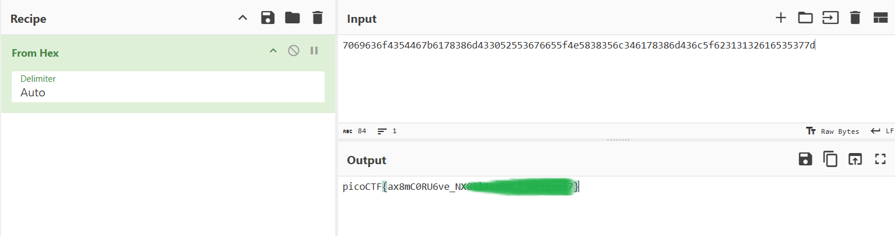

# picoCTF Writeup: Mob psycho

あきらめずにくまなく探す問題

- ジャンル: Forensics
- 難易度: Medium

## Writeup

問題文
>Can you handle APKs?
>Download the android apk here.
>APKを扱えるかな？android apkをここからダウンロードしてね。

いや～、APKファイル？しらんわ～

調べます。
`Android Package Kit`の略、Androidアプリをインストール・配布するためのパッケージと。

ZIP形式で圧縮されており、拡張子を.zipに変更すれば中身を確認することもできる。

やってみますか？

ダウンロードします。
`$ curl -O https://artifacts.picoctf.net/c_titan/141/mobpsycho.apk
`
```
$ file mobpsycho.apk   
mobpsycho.apk: Zip archive data, made by v3.0 UNIX, extract using at least v1.0, last modified Mar 12 2024 00:06:32, uncompressed size 0, method=store
```
おー、fileコマンドでもZipアーカイブって言ってますね。
じゃー、拡張子は変更せずに`unzip`してみます。

```
$ ls
mobpsycho.apk
$ unzip -q mobpsycho.apk
$ ls
AndroidManifest.xml  classes.dex   classes3.dex   res
META-INF             classes2.dex  mobpsycho.apk  resources.arsc
```
おー、展開できましたね。

flag探してみます。
```
$ grep -r pico ./

```
ありません。。。

```
$ find . -type f -exec strings {} + | grep pico

```
ないですね。。。

(しばし格闘)

```
$ find . -name flag.*
./res/color/flag.txt
```
あった！

```
$ cat res/color/flag.txt 
7069636f4354467b6178386d433052553676655f4e5838356c346178386d436c5f62313132616535377d
```
`70`から始まるということは、16進数の`70`で`ASCII`の`p`ですね。

CyberChefに突っ込んで変換します。

flagとれました。（flagはマスクしています。）

## 余談

CyberChefを使わずに、CLIでもやれるようにしたいですね。
```
$ cat res/color/flag.txt | xxd -r -p
picoCTF{ax8mC0RU6ve_NX85l4ax8mCl_XXXXXXXX}
```