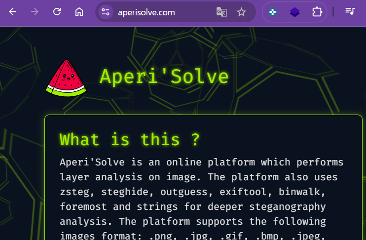
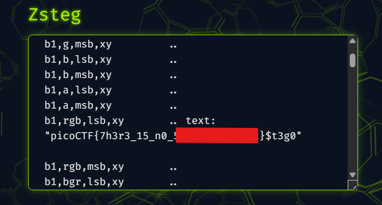

# picoCTF Writeup: St3g0

**LSBステガノグラフィ**というデータ隠ぺい技術を知ろう問題

- ジャンル: Forensics
- 難易度: Medium

## Writeup

問題文はこれだけ。
>Download this image and find the flag.

ファイルをダウンロードします。
`file`コマンドで確認します。

```
┌──(ozaki㉿kali)-[~/Downloads]
└─$ file pico.flag.png            
pico.flag.png: PNG image data, 585 x 172, 8-bit/color RGBA, non-interlaced
```
PNGファイルってだけですね。

`exiftool`もみてみます。
```
┌──(ozaki㉿kali)-[~/Downloads]
└─$ exiftool pico.flag.png            
ExifTool Version Number         : 13.25
File Name                       : pico.flag.png
Directory                       : .
File Size                       : 13 kB
File Modification Date/Time     : 2025:12:07 07:37:35+09:00
File Access Date/Time           : 2025:12:07 07:38:11+09:00
File Inode Change Date/Time     : 2025:12:07 07:37:36+09:00
File Permissions                : -rw-rw-r--
File Type                       : PNG
File Type Extension             : png
MIME Type                       : image/png
Image Width                     : 585
Image Height                    : 172
Bit Depth                       : 8
Color Type                      : RGB with Alpha
Compression                     : Deflate/Inflate
Filter                          : Adaptive
Interlace                       : Noninterlaced
Image Size                      : 585x172
Megapixels                      : 0.101
```

特に手がかりがみつかりません。

<details><summary>`strings`もみます。
長いので折りたたみ</summary>

```
┌──(ozaki㉿kali)-[~/Downloads]
└─$ strings pico.flag.png 
IHDR
4EIDATx
(       sg
"l'(
"z$Jo
        ; c
1&u9
Hd\l
r.Iz
?dW=
^1pc
4s[T
iOLkE
9LV)&
cL:<K
Cq}aI
,(.8XD
'p"R
%p-Z
%@!P
L       4(
&x)'I
tY/-,
7"27
_On'Hu
[M1A
+.,=
U}ZU
|j~1
KZTJD
j;U}
(LVQ
}'MRrc
n\8iaA
H6In
UEEE
\^UyQ
xMUsv
wm;=/?:(
z2vT
=zK.%J
>8{f
K4Rs
59LU
a8m82q
mlkm
9IJ.
?\E$
q>Vn,
WR|h
zc@!
Ozm+
qkV~
5ri;
vYnk
XAqA
ma"|;
85tn!
        K T
MOTNG4
+~>.
2d}]O
RD<]
|ID^
&?:{
$qXc
85u~
9PUQ
cGb!
e+}9-
:O{jv 
        Uu[C
6Iz%
YSGI
o8iI
}<^(9
u]p_
td3p
|w/
,"W4
 "*"o
noL.
IDb"
'-,@}
z~j.
~$"^
p}Zp
PD&{
wy}>
I&{n?
3rMO
d&Un
?6Q[
HD;~
MnK"4
ja0?
6m=K
IRP'
FyZp
gIRf
PP-&
={"LN
7IU{
L>es
6Y(QS
DD*p
MjnM
['e2o
kUuD&s'
'?_iIn
Tee@
q[)|4
GUSZvT
(YU;
S7)]
D"~6
cG/g
.Ic/
qj\ez
g|B"
z9`ri
GI~rs
NUKqjD
y[UO
 m'"
 m'"
p=0PD
fNcE
J/)-
GgK9
7Wy;
5v:0
#"A/
&PU[6mk
Ju1P
PV?!
Brysi
>lh4
d3ye
4o{L
$c$!D
/Q}v
4?"2f
L9 "
h_\2
>i&Z
iLZI
fD!ru
LmW^wS
1nyZ
6s{*
Q=oH
v6mB
+$.#
AN$I
mr.I
{o|Y
I'I;
IEND
```
</details>


うーん、手がかりがみえてきません。

`binwalk`をみてみます。
```
┌──(ozaki㉿kali)-[~/Downloads]
└─$ binwalk pico.flag.png 

DECIMAL       HEXADECIMAL     DESCRIPTION
--------------------------------------------------------------------------------
0             0x0             PNG image, 585 x 172, 8-bit/color RGBA, non-interlaced
41            0x29            Zlib compressed data, default compression
```

特に気になるところないですね。通常のPNGの出力です。

少しググると`zsteg`というツールで展開してくれるようです。
私の`kali`ちゃんにはすぐインストールできなかったので、onlineのツールで進めます。

[CTF Support](https://ctf.support/steganography/image-steganography/)で紹介されている[aperisolve.tf](https://aperisolve.fr/)が使いやすいです。


画像ファイルをアップロードして[Submit]します。

解析画面の`Zsteg`のところにflagがありました。
(flagはマスクしています。)


## もう少し理解したい

一応flagは取りましたが、これだとただツールを使ってたまたまflagがありました～という域をでません。
もう少し技術的に踏み込みたいと思います。

今回の`Zsteg`の出力をもう一度見ると
```
b1,rgb,lsb,xy .. text: "picoCTF{7h3r3_15_n0_5p00n_XXXXXXXX}$t3g0"
```
|出力|意味|
|-|-|
|b1|1チャネルにつき 1ビットだけ使う|
|rgb|R, G, B の3チャネルを使う|
|lsb|各チャネルの LSB（最下位ビット） を使う|
|xy|左上→右に→次の行…という順番で走査|

つまり、各ピクセルの R/G/B それぞれ 8ビットのうち、最下位ビット（LSB）だけを取り出して、左上から順に並べたビット列が「picoCTF{...}$t3g0」になっていたということでした。

`Zsteg`は、いろんなパターンで総当たりで試してくれる便利ツールということでした。
