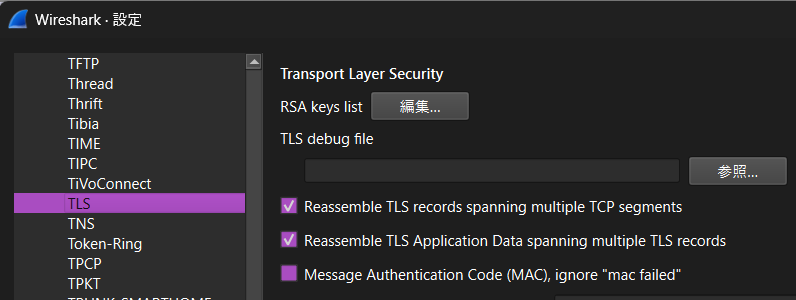
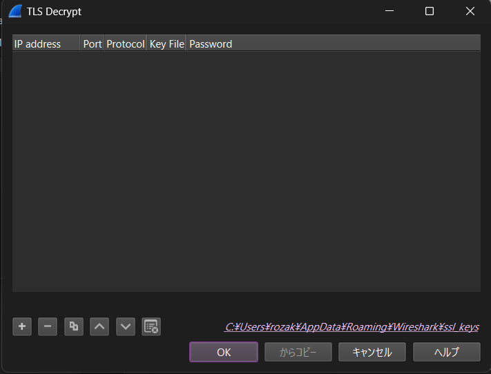
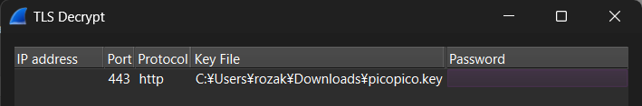
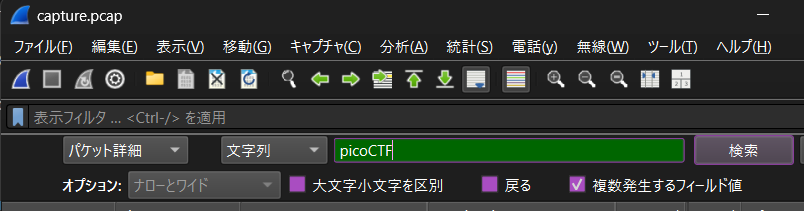
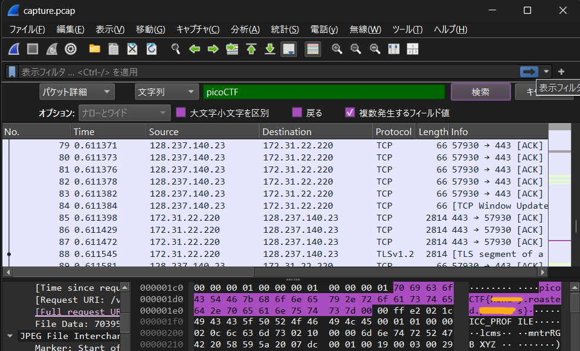

# picoCTF Writeup: WebNet1

**TLSストリーム復号**をやってみよう問題

- ジャンル: Forensics
- 難易度: Hard

## Writeup

問題文
>We found this packet capture and key. Recover the flag.
>パケットキャプチャーファイルと鍵ファイルがあります。flagを復号してね。

`ssldump`というツールがあるらしい。
https://linux.die.net/man/1/ssldump

`kali`には最初から入っていました。
`-k`で鍵指定
`-r`でファイルを指定
`-d`でアプリケーションデータトラフィックを表示

```
┌──(ozaki㉿kali)-[~]
└─$ ssldump -k Downloads/picopico.key -r Downloads/capture.pcap -d | grep -2 pico
    0a 43 6f 6e 74 65 6e 74 2d 45 6e 63 6f 64 69 6e    .Content-Encodin
    67 3a 20 67 7a 69 70 0d 0a 50 69 63 6f 2d 46 6c    g: gzip..Pico-Fl
    61 67 3a 20 70 69 63 6f 43 54 46 7b 74 68 69 73    ag: picoCTF{this
    2e 69 73 2e 6e 6f 74 2e 79 6f 75 72 2e 66 6c 61    .is.not.your.fla
    67 2e 61 6e 79 6d 6f 72 65 7d 0d 0a 43 6f 6e 74    g.anymore}..Cont
--
    43 6f 6e 74 65 6e 74 2d 45 6e 63 6f 64 69 6e 67    Content-Encoding
    3a 20 67 7a 69 70 0d 0a 50 69 63 6f 2d 46 6c 61    : gzip..Pico-Fla
    67 3a 20 70 69 63 6f 43 54 46 7b 74 68 69 73 2e    g: picoCTF{this.
    69 73 2e 6e 6f 74 2e 79 6f 75 72 2e 66 6c 61 67    is.not.your.flag
    2e 61 6e 79 6d 6f 72 65 7d 0d 0a 43 6f 6e 74 65    .anymore}..Conte
--
    Accept-Ranges: bytes
    Content-Length: 70395
    Pico-Flag: picoCTF{this.is.not.your.flag.anymore}
    Keep-Alive: timeout=5, max=99
    Connection: Keep-Alive
--
    00 00 00 1f 00 00 00 5a 02 13 00 03 00 00 00 01    .......Z........
    00 01 00 00 00 00 00 00 00 00 00 01 00 00 00 01    ................
    00 00 00 01 00 00 00 01 70 69 63 6f 43 54 46 7b    ........picoCTF{
    68 6f 6e 65 79 2e 72 6f 61 73 74 65 64 2e 70 65    honey.roasted.pe
    61 6e 75 74 73 7d 00 00 ff e2 02 1c 49 43 43 5f    anuts}......ICC_
Cleaned 4 remaining connection(s) from connection pool
```

いくつかおとりflagがありますが、一番下のflagが答えですね。
(flagはマスクしています。)

`Forensics`において、ツールは偉大ですね。

## Wiresharkでもやってみるか
今回も少し簡単にflagを取れたので、`Wireshark`でもやってみます。

まずは`capture.pcap`を`Wireshark`で開きます。
この状態ではデータは暗号化されたままなので、問題文の鍵ファイルを`Wireshark`に設定して復号していきます。

`Wireshark`の[編集]タブの[設定]を選択します。
ポップアップダイアログの左ペインの`Protcols`を開いて`TLS`を選択します。

RSA keys listの[編集]を選択します。
[TLS Decrypt]というダイアログがポップアップします。
下の[＋]ボタンを押します。



このように入力して[OK]を押します。


前のダイアログに戻るので、そこでも[適用]と[OK]を押します。

そうするとパケットが復号されています。

あとは、`picoCTF`という文字列を検索していきます。
[編集]タブの[パケットの検索]を選択します。

このように入力してください。なお、

:::note warn
注意
[複数発生するフィールド値]にチェックを入れてください。
:::

[検索]を押すたびに、ヒットした文字列に飛んでくれます。


`Wireshark`でもflag取れましたね。
(flagはマスクしています。)