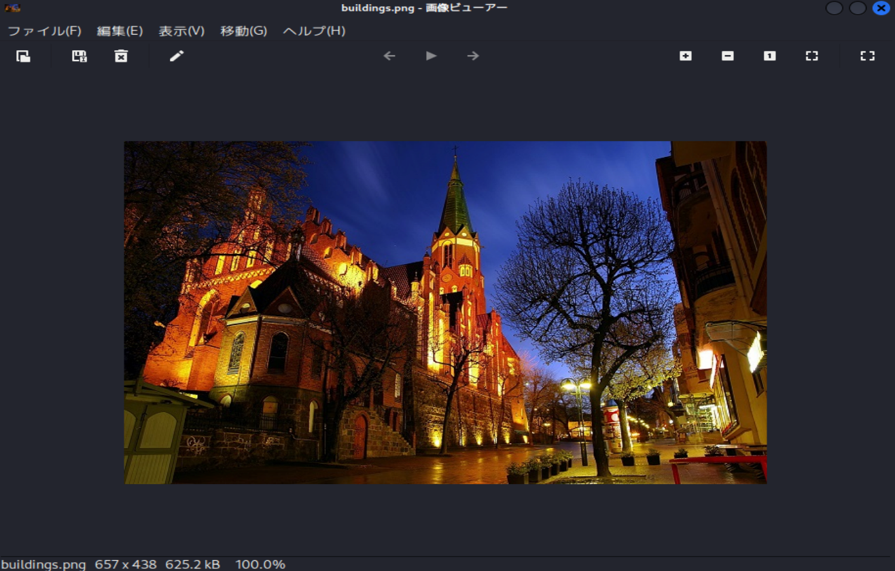

# picoCTF Writeup: What Lies Within

**LSBステガノグラフィ**というデータ隠ぺい技術を知ろう問題

- ジャンル: Forensics
- 難易度: Medium

## Writeup
問題文
>There's something in the building. Can you retrieve the flag?
なんか建物があるね。flagを取り出せるかな？

ファイルをダウンロードします。
```
$ curl -O https://challenge-files.picoctf.net/c_fickle_tempest/c0eec6af0f04316e2bdc4a9f095afd0e2d0121f5e543dbc4a65bb0038d72a993/buildings.png
```

`file`コマンドで確認します。
```
$ file buildings.png 
buildings.png: PNG image data, 657 x 438, 8-bit/color RGBA, non-interlaced
```
PNGファイルです。

`exiftool`でメタ情報を確認します。
```
$ exiftool buildings.png 
ExifTool Version Number         : 13.25
File Name                       : buildings.png
Directory                       : .
File Size                       : 625 kB
File Modification Date/Time     : 2025:12:21 09:04:47+09:00
File Access Date/Time           : 2025:12:21 09:04:50+09:00
File Inode Change Date/Time     : 2025:12:21 09:04:47+09:00
File Permissions                : -rw-rw-r--
File Type                       : PNG
File Type Extension             : png
MIME Type                       : image/png
Image Width                     : 657
Image Height                    : 438
Bit Depth                       : 8
Color Type                      : RGB with Alpha
Compression                     : Deflate/Inflate
Filter                          : Adaptive
Interlace                       : Noninterlaced
Image Size                      : 657x438
Megapixels                      : 0.288
```
異常なし。

`hexdump`でヘッダーを確認します。
```
$ hexdump -C buildings.png| head
00000000  89 50 4e 47 0d 0a 1a 0a  00 00 00 0d 49 48 44 52  |.PNG........IHDR|
00000010  00 00 02 91 00 00 01 b6  08 06 00 00 00 27 6a dd  |.............'j.|
00000020  d8 00 00 20 00 49 44 41  54 78 5e ac bd 4d 8b 24  |... .IDATx^..M.$|
00000030  6b 96 26 76 d2 ca da da  da ca da 70 b9 5c 2e c7  |k.&v.......p.\..|
00000040  e5 04 41 28 95 a4 2e 97  a2 10 4d 33 2b 21 b4 1a  |..A(......M3+!..|
00000050  f4 03 b4 d6 cf 98 85 16  62 16 42 08 2d 06 a1 85  |........b.B.-...|
00000060  16 c3 d0 88 62 18 86 5e  34 8d 68 86 66 10 43 33  |....b..^4.h.f.C3|
00000070  14 45 51 34 cd e5 92 24  49 10 04 31 8e cb 71 f9  |.EQ4...$I..1..q.|
00000080  f8 f8 d8 58 59 db b5 b2  b2 14 cf 73 ce 6b ef 6b  |...XY......s.k.k|
00000090  e6 ee 91 f7 76 77 d4 47  64 b8 db c7 fb 79 ce f3  |....vw.Gd....y..|
```
異常なし。

ビューアーで開いてみます。


確かに建物がありますね。（どこだろ？）
縦横比や色がおかしいとかの、異常はないですね。

そしたらあとは**LSB**でも疑ってみます。
`zsteg`にかけます。
```
$ zsteg buildings.png  
b1,r,lsb,xy         .. text: "^5>R5YZrG"
b1,rgb,lsb,xy       .. text: "picoCTF{h1d1ng_1n_th3_XXXX}"
b1,abgr,msb,xy      .. file: OpenPGP Secret Key
b2,b,lsb,xy         .. text: "XuH}p#8Iy="
b3,abgr,msb,xy      .. text: "t@Wp-_tH_v\r"
b4,r,lsb,xy         .. text: "fdD\"\"\"\" "
b4,r,msb,xy         .. text: "%Q#gpSv0c05"
b4,g,lsb,xy         .. text: "fDfffDD\"\""
b4,g,msb,xy         .. text: "f\"fff\"\"DD"
b4,b,lsb,xy         .. text: "\"$BDDDDf"
b4,b,msb,xy         .. text: "wwBDDDfUU53w"
b4,rgb,msb,xy       .. text: "dUcv%F#A`"
b4,bgr,msb,xy       .. text: " V\"c7Ga4"
b4,abgr,msb,xy      .. text: "gOC_$_@o"
```
**LSB（最下位ビット）** にflagありました。
（flagはマスクしています。）