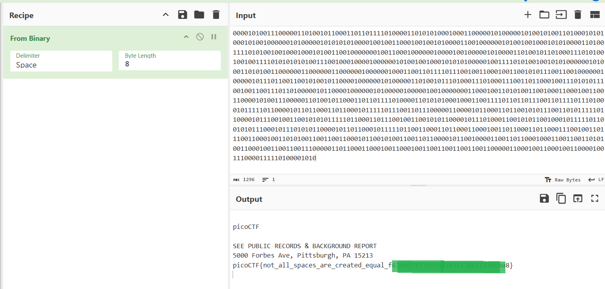

# picoCTF Writeup: WhitePages

**WhitePages問題**を知ろう問題

- ジャンル: Forensics
- 難易度: Medium

## Writeup
問題文
>I stopped using YellowPages and moved onto WhitePages... but the page they gave me is all blank!
>黄色いページをやめて白いページにした。。。でも、真っ白になった!


まずは`curl`でファイルをダウンロードします。
```
curl -O https://challenge-files.picoctf.net/c_fickle_tempest/f35d2be8de731d412d3dbd8c79e6c5b32c62efbb124cf319f54ebddf76ea0ffe/whitepages.txt
```
`file`でファイルをみます。
```
$ file whitepages.txt
whitepages.txt: Unicode text, UTF-8 text, with very long lines (1296), with no line terminators
```
`UTF-8`のテキストファイルですね。

メタデータを`exiftool`で確認します。
```
$ exiftool whitepages.txt
ExifTool Version Number         : 13.25
File Name                       : whitepages.txt
Directory                       : .
File Size                       : 2.8 kB
File Modification Date/Time     : 2025:12:13 07:59:24+09:00
File Access Date/Time           : 2025:12:13 11:55:12+09:00
File Inode Change Date/Time     : 2025:12:13 07:59:24+09:00
File Permissions                : -rw-rw-r--
File Type                       : TXT
File Type Extension             : txt
MIME Type                       : text/plain
MIME Encoding                   : utf-8
Byte Order Mark                 : No
Newlines                        : (none)
Line Count                      : 1
Word Count                      : 343
```
とくに怪しい点はありませんね。

`hexdump`で中身をみてみます。
```
└─$ hexdump -C whitepages.txt | head
00000000  e2 80 83 e2 80 83 e2 80  83 e2 80 83 20 e2 80 83  |............ ...|
00000010  20 e2 80 83 e2 80 83 20  20 20 e2 80 83 e2 80 83  | ......   ......|
00000020  e2 80 83 e2 80 83 e2 80  83 20 20 e2 80 83 20 e2  |.........  ... .|
00000030  80 83 e2 80 83 20 e2 80  83 20 20 e2 80 83 e2 80  |..... ...  .....|
00000040  83 e2 80 83 20 20 e2 80  83 20 20 e2 80 83 20 20  |....  ...  ...  |
00000050  20 20 e2 80 83 20 e2 80  83 e2 80 83 e2 80 83 e2  |  ... ..........|
00000060  80 83 20 20 e2 80 83 20  e2 80 83 20 e2 80 83 20  |..  ... ... ... |
00000070  e2 80 83 e2 80 83 e2 80  83 20 e2 80 83 e2 80 83  |......... ......|
00000080  e2 80 83 20 20 e2 80 83  e2 80 83 e2 80 83 e2 80  |...  ...........|
00000090  83 e2 80 83 20 e2 80 83  20 e2 80 83 e2 80 83 e2  |.... ... .......|
```
`e2 80 83`と`20`だけでできているファイルのようです。

少し調べたところ、`e2 80 83`と`20`はどちらも「空白文字」を表していることが分かりました。
`20`は `Unicode U+0020`の通常のスペースで、
`e2 80 83`は `Unicode U+2003` の `EM SPACE`というスペースを 表現したバイト列です。
見た目はどちらも空白ですが、バイト列が異なるところがポイントです。

このそれぞれの空白を0/1のバイナリにしてみると、flagが浮き出てくるかもしれません。

まずは、
`xxd -p`でプレーン16進数を出して、
`tr`で改行を削除して、
`sed`でそれぞれを0/1に置換します。
```
$ xxd -p whitepages.txt | tr -d '\n' | sed 's/e28083/0/g; s/20/1/g' 
000010100111000001101001011000110110111101000011010101000100011000001010000010100101001101000101010001010010000001010000010101010100001001001100010010010100001100100000010100100100010101000011010011110101001001000100010100110010000000100110001000000100001001000001010000110100101101000111010100100100111101010101010011100100010000100000010100100100010101010000010011110101001001010100000010100011010100110000001100000011000000100000010001100110111101110010011000100110010101110011001000000100000101110110011001010010110000100000010100000110100101110100011101000111001101100010011101010111001001100111011010000010110000100000010100000100000100100000001100010011010100110010001100010011001100001010011100000110100101100011011011110100001101010100010001100111101101101110011011110111010001011111011000010110110001101100010111110111001101110000011000010110001101100101011100110101111101100001011100100110010101011111011000110111001001100101011000010111010001100101011001000101111101100101011100010111010101100001011011000101111101100110001101100011000100110110001101100011100100110111001100010011010100110011001100010110010100110011011000010110010000110011011000100011001100110101001100010011001100111000001101100011000100110001001100110011001100110000011000100110001001100001001110000111110100001010
```

このバイナリを、[CyberChef](https://gchq.github.io/CyberChef/)に突っ込んでみます。



無事にフラグ取れました。（フラグはマスクしています。）

## まとめ
今回の問題は、Unicodeでのスペースでできたバイト列を別ルールでバイナリ化しASCII変換して、flagをとるという問題でした。
文字コードの考え方っていつも混乱しますが、こういう問題を何度もやれば整理・定着してきそうな気がしました。
大変興味深い世界で、今日もよく眠れる。