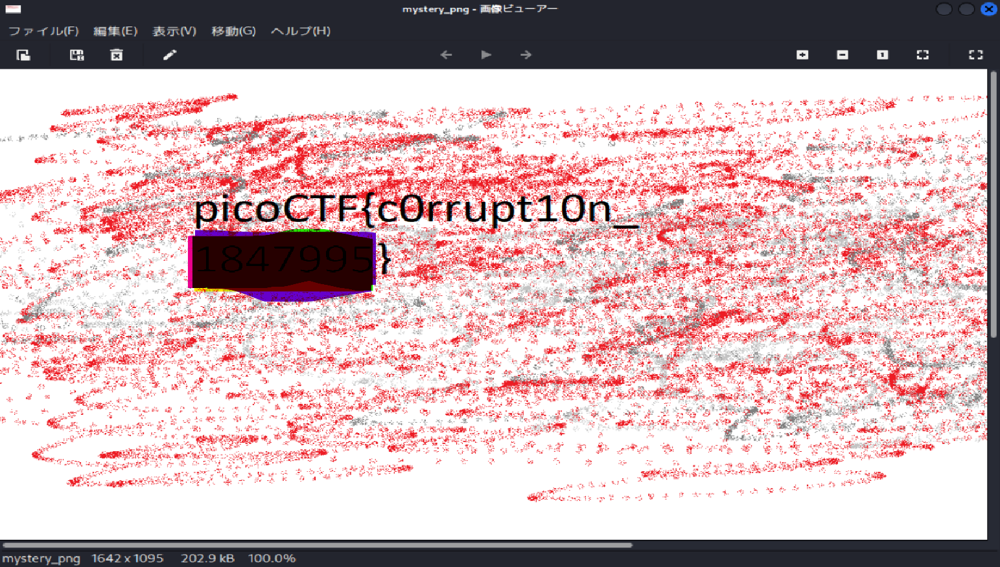

# picoCTF Writeup: c0rrupt

**PNG**をもう少し知ろう問題

- ジャンル: Forensics
- 難易度: Medium

## Writeup
問題文
>We found this file. Recover the flag.
このファイルを見つけた。flagを復元して。

さて、ダウンロードします。
```
$ curl -O https://challenge-files.picoctf.net/c_fickle_tempest/87bdc8ce30b177d033b3d68bca4647950bb07304032861baa912ebe08701d355/mystery
```
`file`コマンド
```
$ file mystery
mystery: data
```
`exiftool`コマンド
```
$ exiftool mystery
ExifTool Version Number         : 13.25
File Name                       : mystery
Directory                       : .
File Size                       : 203 kB
File Modification Date/Time     : 2025:12:19 21:19:57+09:00
File Access Date/Time           : 2025:12:19 22:08:36+09:00
File Inode Change Date/Time     : 2025:12:19 21:19:57+09:00
File Permissions                : -rw-rw-r--
Error                           : Unknown file type
```
何のファイルかわかりませんね。

`hexdump`でマジックナンバー見てみますか。
```
$ hexdump -C mystery | head    
00000000  89 65 4e 34 0d 0a b0 aa  00 00 00 0d 43 22 44 52  |.eN4........C"DR|
00000010  00 00 06 6a 00 00 04 47  08 02 00 00 00 7c 8b ab  |...j...G.....|..|
00000020  78 00 00 00 01 73 52 47  42 00 ae ce 1c e9 00 00  |x....sRGB.......|
00000030  00 04 67 41 4d 41 00 00  b1 8f 0b fc 61 05 00 00  |..gAMA......a...|
00000040  00 09 70 48 59 73 aa 00  16 25 00 00 16 25 01 49  |..pHYs...%...%.I|
00000050  52 24 f0 aa aa ff a5 ab  44 45 54 78 5e ec bd 3f  |R$......DETx^..?|
00000060  8e 64 cd 71 bd 2d 8b 20  20 80 90 41 83 02 08 d0  |.d.q.-.  ..A....|
00000070  f9 ed 40 a0 f3 6e 40 7b  90 23 8f 1e d7 20 8b 3e  |..@..n@{.#... .>|
00000080  b7 c1 0d 70 03 74 b5 03  ae 41 6b f8 be a8 fb dc  |...p.t...Ak.....|
00000090  3e 7d 2a 22 33 6f de 5b  55 dd 3d 3d f9 20 91 88  |>}*"3o.[U.==. ..|
```

若干PNGっぽい

下がPNGの例
```
$ hexdump -C ../extensions/flag.png | head
00000000  89 50 4e 47 0d 0a 1a 0a  00 00 00 0d 49 48 44 52  |.PNG........IHDR|
00000010  00 00 06 a1 00 00 02 60  08 02 00 00 00 85 ad 5e  |.......`.......^|
00000020  9a 00 00 00 01 73 52 47  42 00 ae ce 1c e9 00 00  |.....sRGB.......|
00000030  00 04 67 41 4d 41 00 00  b1 8f 0b fc 61 05 00 00  |..gAMA......a...|
00000040  00 09 70 48 59 73 00 00  16 25 00 00 16 25 01 49  |..pHYs...%...%.I|
00000050  52 24 f0 00 00 26 95 49  44 41 54 78 5e ed dd 6b  |R$...&.IDATx^..k|
00000060  42 1b 39 b7 05 d0 3b 2e  06 94 f1 30 9a 4c 26 83  |B.9...;....0.L&.|
00000070  f9 ae 5f 80 4e 3d 25 bb  4c b3 f1 5a bf ba a1 4a  |.._.N=%.L..Z...J|
00000080  75 74 24 13 79 27 c0 ff  fd 0f 00 00 00 00 48 26  |ut$.y'........H&|
00000090  e3 03 00 00 00 80 6c 32  3e 00 00 00 00 c8 26 e3  |......l2>.....&.|
```

PNGに合わせて`hexedit`で直していきますか。
まずファイルはコピーしておいて
```
$ cp mystery mystery_png
```
`hexedit`します。
```
$ hexdump -C mystery_png | head           
00000000  89 50 4e 47 0d 0a 1a 0a  00 00 00 0d 49 48 44 52  |.PNG........IHDR|
00000010  00 00 06 6a 00 00 04 47  08 02 00 00 00 7c 8b ab  |...j...G.....|..|
00000020  78 00 00 00 01 73 52 47  42 00 ae ce 1c e9 00 00  |x....sRGB.......|
00000030  00 04 67 41 4d 41 00 00  b1 8f 0b fc 61 05 00 00  |..gAMA......a...|
00000040  00 09 70 48 59 73 aa 00  16 25 00 00 16 25 01 49  |..pHYs...%...%.I|
00000050  52 24 f0 00 00 ff a5 49  44 41 54 78 5e ec bd 3f  |R$.....IDATx^..?|
00000060  8e 64 cd 71 bd 2d 8b 20  20 80 90 41 83 02 08 d0  |.d.q.-.  ..A....|
00000070  f9 ed 40 a0 f3 6e 40 7b  90 23 8f 1e d7 20 8b 3e  |..@..n@{.#... .>|
00000080  b7 c1 0d 70 03 74 b5 03  ae 41 6b f8 be a8 fb dc  |...p.t...Ak.....|
00000090  3e 7d 2a 22 33 6f de 5b  55 dd 3d 3d f9 20 91 88  |>}*"3o.[U.==. ..|
```
編集した部分は以下の通りです。
|No.|値FROM|値TO|意味合い|
|-|-|-|-|
|1|`89 65 4e 34 0d 0a b0 aa`|`89 50 4e 47 0d 0a 1a 0a`|PNGシグネチャ|
|2|`43 22 44 52`|`49 48 44 52`|IHDR|
|3|`aa aa ff a5`|`00 00 ff a5`|IDATチャンクサイズ|
|4|`ab  44 45 54`|`49 44 41 54`|IDAT|

特に No.3 がわかりにくいですね。

PNGはビッグエンディアン仕様なので、`aa aa ff a5`は`0xAAAAFFA5`と解釈します。
かなり大きな数字です、ファイルサイズにすると約2.8GBになります。

先ほどの`exiftool`でも`203 kB`だったので、明らかに大きすぎますね。

そのため、`aa aa`を`00 00`にしてみたということです。

その結果、ビューアーで開けるようになりました。

flag がとれました。（flagはマスクしています。）