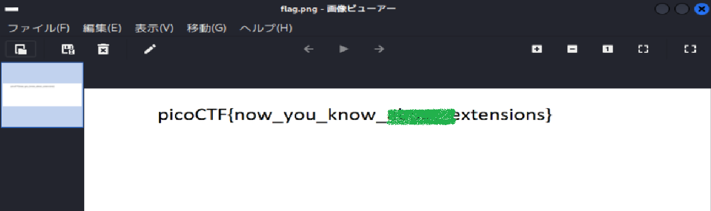

# picoCTF Writeup: extensions

ファイル拡張子とマジックナンバーの違いを見抜く問題

- ジャンル: Forensics
- 難易度: Medium

## Writeup

問題文
>This is a really weird text file. Can you find the flag?
>Get the flag from TXT.
これはほんとに奇妙なテキストファイルです。flagを見つけられるかな？TXTからflagをゲットしてね。

TXTファイルをダウンロードします。
`$ curl -O https://challenge-files.picoctf.net/c_fickle_tempest/31fe772e6a4c71e867af0b2a93818e06d8f8ebf8af2a9615495d00356ff576da/flag.txt`

fileコマンド
```
$ file flag.txt 
flag.txt: PNG image data, 1697 x 608, 8-bit/color RGB, non-interlaced
```

早速、PNGイメージとか言っていますね。。。
`exiftool`も見てみます。
```
└─$ exiftool flag.txt      
ExifTool Version Number         : 13.25
File Name                       : flag.txt
Directory                       : .
File Size                       : 10.0 kB
File Modification Date/Time     : 2025:12:15 06:39:45+09:00
File Access Date/Time           : 2025:12:15 06:39:57+09:00
File Inode Change Date/Time     : 2025:12:15 06:39:45+09:00
File Permissions                : -rw-rw-r--
File Type                       : PNG
File Type Extension             : png
MIME Type                       : image/png
Image Width                     : 1697
Image Height                    : 608
Bit Depth                       : 8
Color Type                      : RGB
Compression                     : Deflate/Inflate
Filter                          : Adaptive
Interlace                       : Noninterlaced
SRGB Rendering                  : Perceptual
Gamma                           : 2.2
Pixels Per Unit X               : 5669
Pixels Per Unit Y               : 5669
Pixel Units                     : meters
Image Size                      : 1697x608
Megapixels                      : 1.0
```
やはりTXTなのにPNGと言っているところから攻めましょうか。
マジックナンバー（ファイルの冒頭にある識別子）を確認します。
```
$ hexdump -C flag.txt| head       
00000000  89 50 4e 47 0d 0a 1a 0a  00 00 00 0d 49 48 44 52  |.PNG........IHDR|
00000010  00 00 06 a1 00 00 02 60  08 02 00 00 00 85 ad 5e  |.......`.......^|
00000020  9a 00 00 00 01 73 52 47  42 00 ae ce 1c e9 00 00  |.....sRGB.......|
00000030  00 04 67 41 4d 41 00 00  b1 8f 0b fc 61 05 00 00  |..gAMA......a...|
00000040  00 09 70 48 59 73 00 00  16 25 00 00 16 25 01 49  |..pHYs...%...%.I|
00000050  52 24 f0 00 00 26 95 49  44 41 54 78 5e ed dd 6b  |R$...&.IDATx^..k|
00000060  42 1b 39 b7 05 d0 3b 2e  06 94 f1 30 9a 4c 26 83  |B.9...;....0.L&.|
00000070  f9 ae 5f 80 4e 3d 25 bb  4c b3 f1 5a bf ba a1 4a  |.._.N=%.L..Z...J|
00000080  75 74 24 13 79 27 c0 ff  fd 0f 00 00 00 00 48 26  |ut$.y'........H&|
00000090  e3 03 00 00 00 80 6c 32  3e 00 00 00 00 c8 26 e3  |......l2>.....&.|
```
PNGになっていますね。

TXTに直せるか、TXTのマジックナンバーを確認します。
調べたところTXTファイルはマジックナンバーを持たないらしいです。

となると、、、、
このファイルはTXTファイルではなく、PNGファイルなんか？と思いました。

PNGファイルにしてビューアーで開いてみます。
`$ mv flag.txt flag.png`


flagとれました。（flagはマスクしています。）