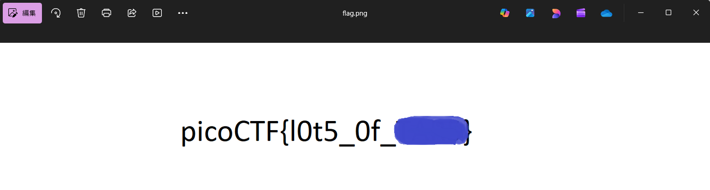

# picoCTF Writeup: like_1000

**tar-ball chain**を解いてみよう問題

- ジャンル: Forensics
- 難易度: Medium

## Writeup
問題文
>This .tar file got tarred a lot.
>この.tarファイルはたくさんtarされた。

まずファイルをダウンロードします。
```
$ curl -O https://challenge-files.picoctf.net/c_fickle_tempest/cd3d027215d8cfee8a81a7700f7b6d2f4bd33d5f481c4464e3766055408fc935/1000.tar
$ ls *.tar
1000.tar
```

tar解凍してみます。
```
ozaki@NucBoxM5PLUS:/tmp$ tar -xvf 1000.tar 
999.tar
filler.txt
ozaki@NucBoxM5PLUS:/tmp$ tar -xvf 999.tar 
998.tar
filler.txt
ozaki@NucBoxM5PLUS:/tmp$ tar -xvf 998.tar
997.tar
filler.txt
ozaki@NucBoxM5PLUS:/tmp$ tar -xvf 997.tar
996.tar
filler.txt
```
なるほど～、1000回コマンド打てば解けそうですね。
1000回はきついのでbashスクリプト書きます。
```
$ cat tar-loop.sh 
#!/bin/bash

file="1000.tar"

while [[ -f "$file" ]]; do
    echo "[*] Extracting $file ..."

    next=$(tar -xvf "$file" | head -n 1)

    file="$next"
done

echo "[+] Finished."
```

実行権限を与えて
```
$ chmod +x tar-loop.sh
```
実行します。

:::note warn
なお、tarファイルでディレクトリ配下が散らかりますので、専用のディレクトリを用意した方がいいです。
:::

```
$ ./tar-loop.sh 
[*] Extracting 1000.tar ...
[*] Extracting 999.tar ...
[*] Extracting 998.tar ...
[*] Extracting 997.tar ...
[*] Extracting 996.tar ...
[*] Extracting 995.tar ...
[*] Extracting 994.tar ...
[*] Extracting 993.tar ...
[*] Extracting 992.tar ...
[*] Extracting 991.tar ...
[*] Extracting 990.tar ...
つづく
[*] Extracting 3.tar ...
[*] Extracting 2.tar ...
[*] Extracting 1.tar ...
[*] Extracting flag.png ...
tar: This does not look like a tar archive
tar: Skipping to next header
tar: Exiting with failure status due to previous errors
[+] Finished.
```
終わりました。
```
$ ls | grep flag
flag.png
```
flagありますね。
flag.pngを開きます。

flagとれました。（flagはマスクしています。）


この問題は **「tar-ball chain」** と呼ばれる典型的な CTF トリックらしいです。