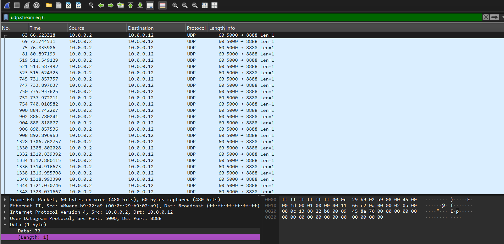
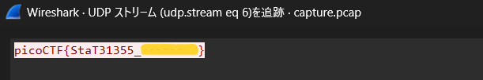
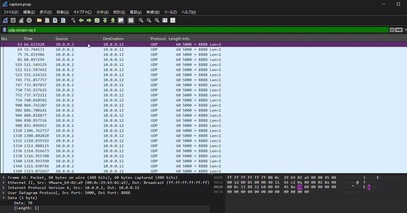

# picoCTF Writeup: shark on wire 1

**Wireshark**を使ってみよう問題

- ジャンル: Forensics
- 難易度: Medium

## Writeup

問題文
> We found this packet capture. Recover the flag.
> 我々はこのパケットキャプチャを見つけた。flagを復元せよ。

パケットキャプチャファイルをダウンロードしました。
Wireshark🦈で開きます。

Wiresharkをダウンロードします。
https://2.na.dl.wireshark.org/win64/
`Wireshark-4.6.1-x64.exe`

exe起動して、インストールします。
デフォルト状態で[Next]を連打してインストール完了です。

Wiresharkでパケットキャプチャファイルを開きます。

まず、このパケットキャプチャファイルの統計情報を確認してみます。
[統計]タブから[プロトコル階層]や[終端]などを見ましたが、IPv4通信、UDP通信が多いなぁ、くらいしか掴めませんでした。

ヒントを見てみます。
> Try using a tool like Wireshark, What are streams?
> Wiresharkみたいなツールを使ってみてね、streamsって何だろう？

`streams`とは何か掴めば、flagが見えてくるのかな？🤔
`streams`(ストリーム)についてググりました。

`streams`(ストリーム)とは**TCP/UDP通信セッション全体**を意味する。
セッションとは、通信の開始から終了までの一連のやり取りのこと。

そして、Wireshark🦈には**ストリーム追跡機能**がある。

TCPストリームの場合は、フィルタで`tcp.stream eq 数字`して [分析]タブ - [追跡]で通信内容を確認できます。

今回の問題では、TCP通信は成功しておらずUDP通信が多かったので、
`udp.stream eq 0`からカウントアップしながら見ていきました。

`udp.stream eq 6` まで来ました。

[分析]タブ - [追跡] - [UDPストリーム] を確認したところ、

flag取れました。

## 振り返り
ストリームのパケットが、どのようにしてflagになったのかをちゃんと確認しておきたいですね。

改めて、こちらの画面のパケットを見ていると、Dataは`Lengh=1`が連続しています。

そして、下のgif画面の右下の紫ハッチをみていると、
パケットを下に送るとp i c o C T F { とflagになっているのがわかるかと思います。

