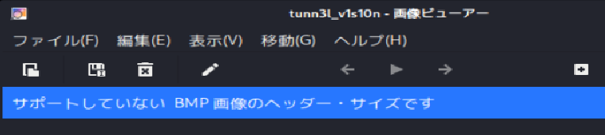
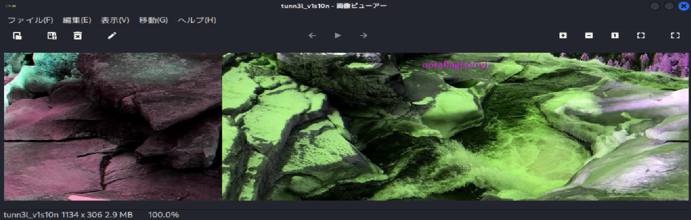
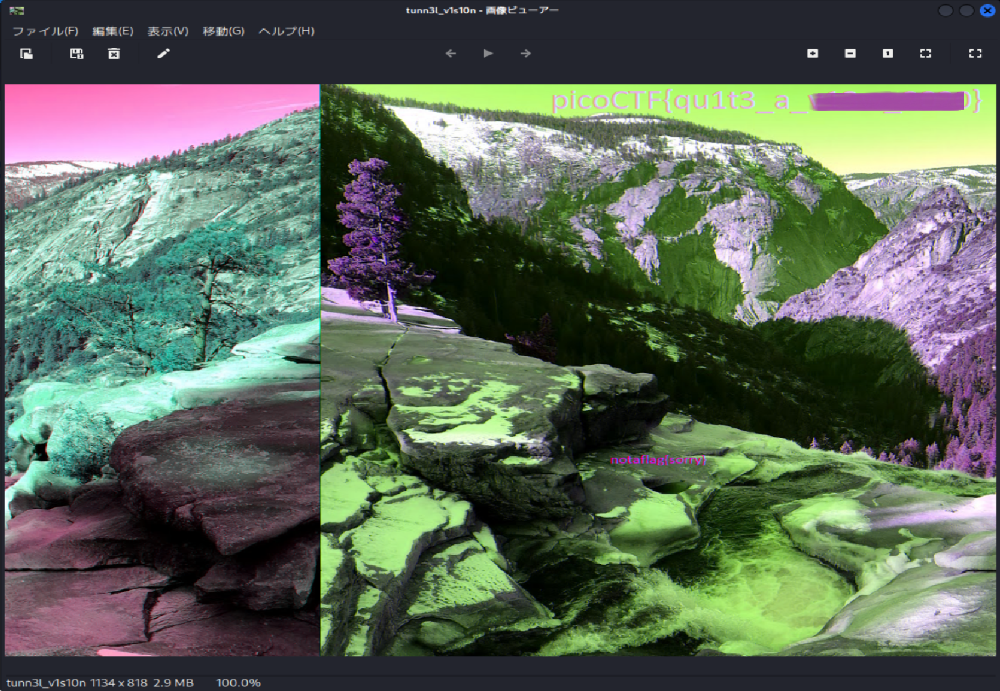

# picoCTF Writeup: tunn3l v1s10n

`bmp`ファイルについて勉強しよう問題

- ジャンル: Forensics
- 難易度: Medium

## Writeup

問題文
>We found this file. Recover the flag.

ダウンロードします。
```
# curl -O https://mercury.picoctf.net/static/d0129ad98ba9258ab59e7700a1b18c14/tunn3l_v1s10n
```                                                                           

`file`コマンド
```
# file tunn3l_v1s10n 
tunn3l_v1s10n: data
```                                                                              

`exiftool`コマンド
```
# exiftool tunn3l_v1s10n 
ExifTool Version Number         : 13.25
File Name                       : tunn3l_v1s10n
Directory                       : .
File Size                       : 2.9 MB
File Modification Date/Time     : 2025:12:18 10:59:27+09:00
File Access Date/Time           : 2025:12:18 10:59:31+09:00
File Inode Change Date/Time     : 2025:12:18 10:59:27+09:00
File Permissions                : -rw-r--r--
File Type                       : BMP
File Type Extension             : bmp
MIME Type                       : image/bmp
BMP Version                     : Unknown (53434)
Image Width                     : 1134
Image Height                    : 306
Planes                          : 1
Bit Depth                       : 24
Compression                     : None
Image Length                    : 2893400
Pixels Per Meter X              : 5669
Pixels Per Meter Y              : 5669
Num Colors                      : Use BitDepth
Num Important Colors            : All
Red Mask                        : 0x27171a23
Green Mask                      : 0x20291b1e
Blue Mask                       : 0x1e212a1d
Alpha Mask                      : 0x311a1d26
Color Space                     : Unknown (,5%()
Rendering Intent                : Unknown (826103054)
Image Size                      : 1134x306
Megapixels                      : 0.347
```

`BMP`ファイルみたいですね。

ビューアーで開いてみます。

サポートされてないヘッダー・サイズですとのこと。

ちょっとBMPファイルの中身をのぞいてみます。
```
# hexdump -C tunn3l_v1s10n| head 
00000000  42 4d 8e 26 2c 00 00 00  00 00 ba d0 00 00 ba d0  |BM.&,...........|
00000010  00 00 6e 04 00 00 32 01  00 00 01 00 18 00 00 00  |..n...2.........|
00000020  00 00 58 26 2c 00 25 16  00 00 25 16 00 00 00 00  |..X&,.%...%.....|
00000030  00 00 00 00 00 00 23 1a  17 27 1e 1b 29 20 1d 2a  |......#..'..) .*|
00000040  21 1e 26 1d 1a 31 28 25  35 2c 29 33 2a 27 38 2f  |!.&..1(%5,)3*'8/|
00000050  2c 2f 26 23 33 2a 26 2d  24 20 3b 32 2e 32 29 25  |,/&#3*&-$ ;2.2)%|
00000060  30 27 23 33 2a 26 38 2c  28 36 2b 27 39 2d 2b 2f  |0'#3*&8,(6+'9-+/|
00000070  26 23 1d 12 0e 23 17 11  29 16 0e 55 3d 31 97 76  |&#...#..)..U=1.v|
00000080  66 8b 66 52 99 6d 56 9e  70 58 9e 6f 54 9c 6f 54  |f.fR.mV.pX.oT.oT|
00000090  ab 7e 63 ba 8c 6d bd 8a  69 c8 97 71 c1 93 71 c1  |.~c..m..i..q..q.|
```

`Wikipedia`で勉強しないとさっぱりです。

最初は**ビットマップファイルヘッダー**から始まります。
>このバイトブロックはファイルの先頭にあり、ファイルを識別するために使用されます。一般的なアプリケーションは、まずこのブロックを読み取り、ファイルが実際にBMPファイルであり、破損していないことを確認します。

|バイト開始位置|16進数|意味合い|
|-|-|-|
|0|`42 4d`|マジックナンバー|
|2|`8e 26 2c 00`|ファイルサイズ[Byte]|
|6|`00 00`|予約|
|8|`00 00`|予約|
|10|`ba d0 00 00`|画像の開始アドレス|

14バイト目から**DIBヘッダー**が始まります。

|バイト開始位置|16進数|意味合い|
|-|-|-|
|14|`ba d0 00 00`|DIBヘッダーのバイト数、BMPでは40バイトが正常値|
|18|`6e 04 00 00`|画像の幅|
|22|`32 01 00 00`|画像の高さ|
|26|`01 00`|カラープレーンの数、BMPでは1|
|28|`18 00`|ピクセルあたりのbit数、24bit|

ヘッダーサイズを指定しているのは、14バイト目のDIBヘッダーサイズですね。
`ba d0 00 00`はリトルエンディアンで逆から`0000d0ba`で10進数にすると`53434`と。。。
`BMP`ファイルの場合、`40`が正常らしいので明らか異常値ですね。

`hexedit`で`40`の`28 00 00 00`に直します。
```
# hexdump -C tunn3l_v1s10n| head
00000000  42 4d 8e 26 2c 00 00 00  00 00 ba d0 00 00 28 00  |BM.&,.........(.|
00000010  00 00 6e 04 00 00 32 01  00 00 01 00 18 00 00 00  |..n...2.........|
```
直しました。

開いてみます。

おー、開けましたね。
`notaflag{sorry}`って書いてありますね。やかましわっ！

ここから、MSBを疑ってPILを使ったpython3スクリプトを書いたり、
`imagemagic`で画像を分割して並び替えたり、
`zsteg`に突っ込んだりしましたが、ダメでした。。。

ちょっと画像が横長すぎん？とは思いましたが、まさかこんなことだとは。

画像の高さをいじったらflagが見えてくるなんてことないよね？

22バイト目から始まる`32 01 00 00`をいじってみます。
リトルエンディアンであることに気を付けて、`32 03 00 00`にしてみます。
```
# hexdump -C tunn3l_v1s10n| head
00000000  42 4d 8e 26 2c 00 00 00  00 00 ba d0 00 00 28 00  |BM.&,.........(.|
00000010  00 00 6e 04 00 00 32 03  00 00 01 00 18 00 00 00  |..n...2.........|
```
ビューアーで開きます。


お気づきだろうか。。。

右上にflag。（flagはマスクしています。）


## 余談
問題の`Hints`に書いてあるけど、これじゃわからんか。
いや、わかるか。表示されるはずなのに、されないという風に読めれば。
>Weird that it won't display right...
奇妙だな、ちゃんと表示されない。。。

## 参考
[Wikipedia: BMP_file_format](https://en.wikipedia.org/wiki/BMP_file_format)