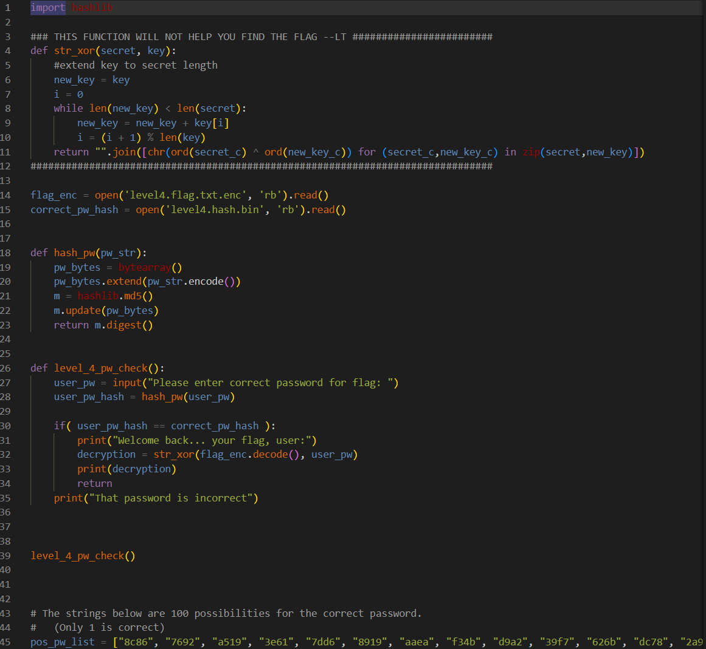
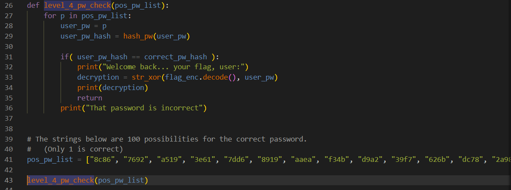

# picoCTF Writeup: PW_Crack_4

**Python**を書いてみよう問題

- ジャンル: General Skills
- 難易度: Medium

## Writeup

問題文
>Can you crack the password to get the flag?
Download the password checker here and you'll need the encrypted flag and the hash in the same directory too.
There are 100 potential passwords with only 1 being correct. You can find these by examining the password checker script.
> パスワードをクラックしてflagをとれるかな？
パスワードチェッカーをダウンロードして、暗号化されたflagとハッシュを同じディレクトリに配置してね。
100個のパスワードがあるけど、その中の1つが正解だよ。パスワードチェッカースクリプトでみつけられるよ。

まずは3ファイルをダウンロードします。
|ファイル名|内容|
|-|-|
|level4.py|パスワードチェッカーPythonスクリプト|
|level4.flag.txt.enc|flagが入った暗号化ファイル|
|level4.hash.bin|ハッシュ値が入ったバイナリファイル|

level4.pyを見ていきます。

`str_xor()`関数があって、
`flag_enc`変数に`level4.flag.txt.enc`を読み込んで、
`correct_pw_hash`変数に`level4.hash.bin`を読み込んでます。

`hash_pw()`関数はmd5のハッシュ値を返します。
`level4_pw_check()`関数はパスワードチェッカーで、`correct_pw_hash`とユーザーが入力したパスワードが一致するかみています。

そして、`level4_pw_check()`関数を呼び出しています。

最後に`pos_pw_list`という、**パスワードの候補リスト**がありました。
このリストの中に正解のパスワードがあります。

このスクリプトを更新して`pos_pw_list`の要素を全部チェッカーに入れて、正解のパスワードを探しましょう。

更新内容は、
`level4_pw_check()`関数の場所を一番下にして、
`pos_pw_list`を引数に渡して`for`で回しています。


では、更新したスクリプトを実行してみます。
`$ chmod +x level4.py`して
```
$ python3 level4.py 
That password is incorrect
That password is incorrect
That password is incorrect
That password is incorrect
That password is incorrect
That password is incorrect
That password is incorrect
That password is incorrect
That password is incorrect
That password is incorrect
That password is incorrect
That password is incorrect
That password is incorrect
That password is incorrect
That password is incorrect
That password is incorrect
That password is incorrect
That password is incorrect
That password is incorrect
That password is incorrect
That password is incorrect
That password is incorrect
That password is incorrect
That password is incorrect
That password is incorrect
That password is incorrect
That password is incorrect
That password is incorrect
That password is incorrect
That password is incorrect
That password is incorrect
That password is incorrect
That password is incorrect
That password is incorrect
That password is incorrect
That password is incorrect
That password is incorrect
That password is incorrect
That password is incorrect
That password is incorrect
That password is incorrect
That password is incorrect
That password is incorrect
That password is incorrect
That password is incorrect
That password is incorrect
That password is incorrect
That password is incorrect
That password is incorrect
That password is incorrect
That password is incorrect
That password is incorrect
That password is incorrect
That password is incorrect
That password is incorrect
That password is incorrect
That password is incorrect
That password is incorrect
That password is incorrect
That password is incorrect
That password is incorrect
That password is incorrect
That password is incorrect
That password is incorrect
That password is incorrect
That password is incorrect
That password is incorrect
That password is incorrect
That password is incorrect
That password is incorrect
That password is incorrect
That password is incorrect
That password is incorrect
That password is incorrect
That password is incorrect
That password is incorrect
That password is incorrect
That password is incorrect
That password is incorrect
That password is incorrect
That password is incorrect
Welcome back... your flag, user:
picoCTF{fl45h_5pr1ng1ng_XXXXXXXX}
```
flagがとれました。（flagはマスクしています。）