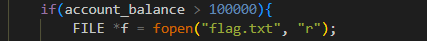
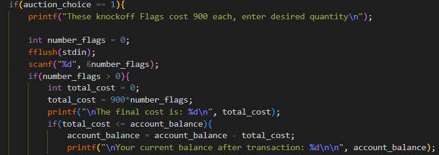

# picoCTF Writeup: flag_shop

**整数オーバーフロー**を知ろう問題

- ジャンル: General Skills
- 難易度: Medium

## Writeup

問題文はこんな感じです。
> flagショップで旗を買えるかな？
> 詳細はインスタンスを起動してね

インスタンスを起動します。
ソースコードのリンクと、
`nc fickle-tempest.picoctf.net 65085`で接続するという説明。

```
ozaki@NucBoxM5PLUS:~/project/picoCTF$  nc fickle-tempest.picoctf.net 65085
Welcome to the flag exchange
We sell flags

1. Check Account Balance
2. Buy Flags
3. Exit

 Enter a menu selection
 ```

1.を選択する。最初は1100円持っている状態で始まります。
`Balance: 1100`

そして、2.を選択します。
```
Currently for sale
1. Defintely not the flag Flag
2. 1337 Flag
```
1は、picoCTFのflagじゃないflag(900円)
2は、たぶんpicoCTFのflag
`1337 flags cost 100000 dollars, and we only have 1 in stock`
でも、バチクソ高くて買えない。

プログラムの動きの確認はこれくらいにして、ソースコードを見てみます。


`account_balance`が100000円より多くあれば`flag.txt`が表示されそうですね。

では、`account_balance`を増やすには、どうしたらいいのか。


`total_cost = 900*number_flags;`と
`account_balance = account_balance - total_cost;`に着目しました。
`number_flags`がマイナスだったら、`total_cost`がマイナスになり、`account_balance`が増えていきそうな未来。

で、プログラムでマイナス値を入力してみましたが、手ごたえなく、`account_balance`は増えませんでした。

ここで、**ヒント**を見ます。
>Two's compliment can do some weird things when numbers get really big!
>数字が本当に大きくなると、2 の補数は奇妙な結果をもたらすことがあります。

`2の補数`とか、聞いたことしかありませんが、大きい数字を入れればflagは取れるのかもしれません。
やってみます。

```
Welcome to the flag exchange
We sell flags

1. Check Account Balance
2. Buy Flags
3. Exit

 Enter a menu selection
2　<-入力
Currently for sale
1. Defintely not the flag Flag
2. 1337 Flag
1　<-入力
These knockoff Flags cost 900 each, enter desired quantity
123456789　<-入力

The final cost is: -558039596

Your current balance after transaction: 558040696
```
`account_balance`増えましたね。
目的のflagを購入します。

```
Welcome to the flag exchange
We sell flags

1. Check Account Balance
2. Buy Flags
3. Exit

 Enter a menu selection
2
Currently for sale
1. Defintely not the flag Flag
2. 1337 Flag
2
1337 flags cost 100000 dollars, and we only have 1 in stock
Enter 1 to buy one1
YOUR FLAG IS: picoCTF{m0n3y_bag5_XXXXXXXX}
```
flag取れました。（一応マスクしてます。）

## どういう仕組みでflagが取れたのか

ちゃんと仕組みも勉強します。
C言語の`int`は一般的に32bitで`signed int(符号付き整数)`を表します。
最上位のbitがMSB(`Most Significant Bit`)で、最後にLSB(`Least Significant Bit`)があります。

`int`の最大値は
`01111111 11111111 11111111 11111111` = `2147483647` (MSBは`0`)
`int`の最小値は
`10000000 00000000 00000000 00000000` = `-2147483648` (MSBは`1`)

今回の問題では、
`total_cost = 900*number_flags;`の部分で
`900*number_flags`が`int`の正の最大値を超えてしまい、
下位の32bitだけが残り、MSBが`1`だったため、
**2の補数**ルール（ビット反転＋1）で、**負の整数**として解釈されたということでした。

理解はできますが、普段使わない話で「へぇ～、おもしろい」の域ですね。

## オーバーフローを避けるには？
- 計算前に`int`の最大値を超えないようにする範囲チェックを入れる。
- 型を`long long`にする（ただしオーバーフロー自体を完全には防げない）
- GCCのオーバーフロー検知ビルトイン関数（__builtin_mul_overflow）を使う。
