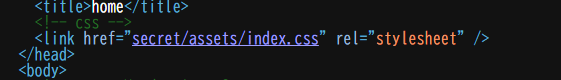
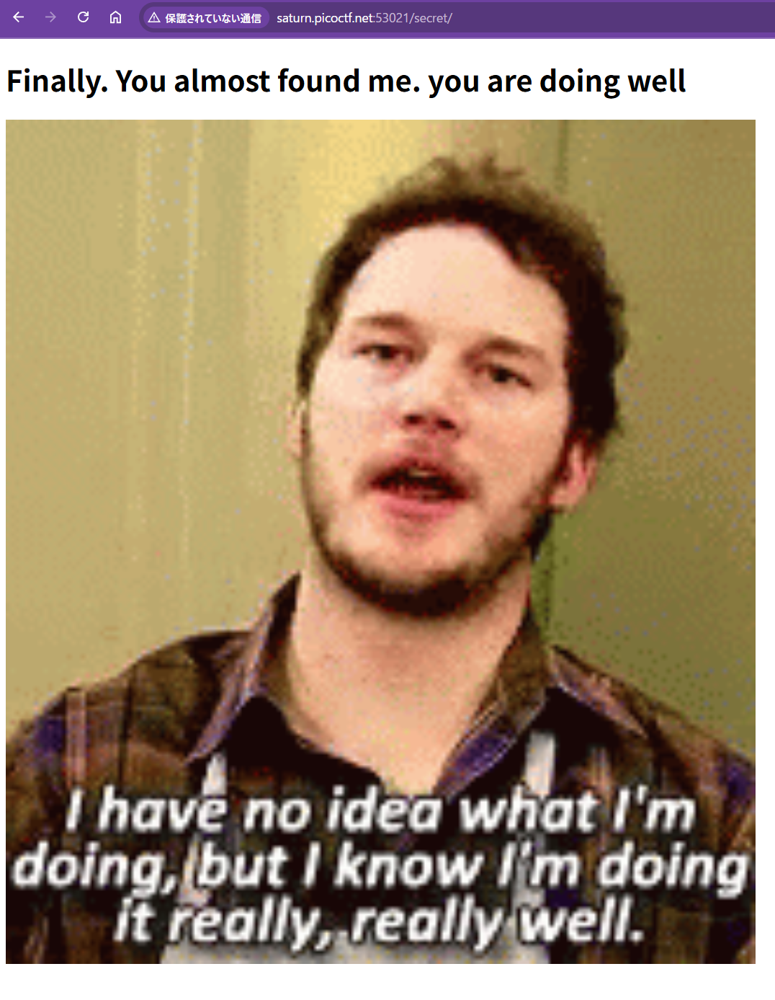
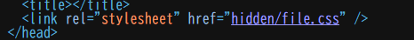
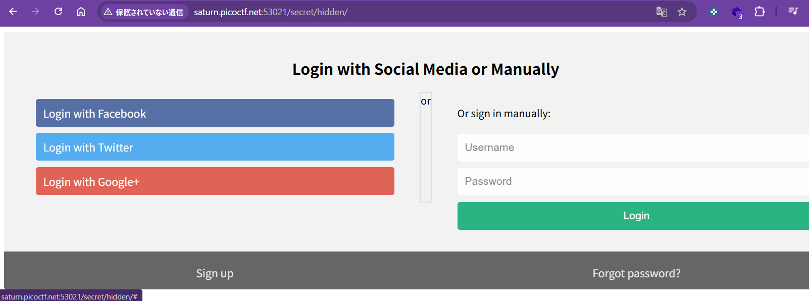
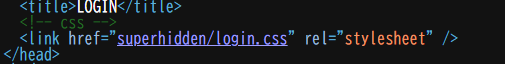
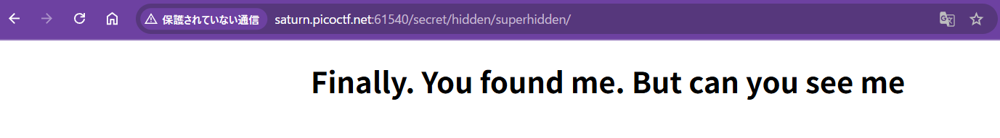
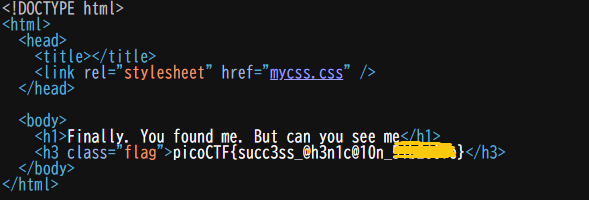

# picoCTF Writeup: Secrets

**面倒臭がらず、くまなく見る力**を鍛えよう問題

- ジャンル: Web Exploitation
- 難易度: Medium

## Writeup

問題文はこんな感じです。
>We have several pages hidden. Can you find the one with the flag?
>The website is running here.
>いくつかの隠されたページがある。flagとともにそのページを見つけれられる？
>websiteはここで動いてます。

websiteに行ってみて、まず下記の3ページの存在を確認できます。
index.html, about.html, contact.html

特にJavaScriptもFormもなく動きのないページのため、ソースを見ていきます。
すべてのhtmlで`secret/assets/`のファイルを呼び出していることに気づきました。

`secret/assets/index.css` は普通のCSSでした。
`secret/assets/` は `403 Forbidden`でした。
`secret/` は なんだかふざけたページが返ってきました。

このページも特に機能がないので、ソースを見ていきます。

ここからも同じく手当たりしだいみていきます。
`secret/hidden/file.css` はなにも返ってきません。
`secret/hidden/` は ログインページのようなものが返ってきました。

`Login`ボタンや`Sign up`ボタンを一通り押してみました。
しかし、JavaScriptのアラートで`"Thank you for the attempt but oops! try harder. better luck next time"`と出てくるだけです。

こちらもソースを見ていきます。

もうわかりますよね？
`secret/hidden/superhidden` にアクセスします。

「ついに見つけましたね。でも見えるかな？」と書いてあります。
ソースを見ていきます。

flag取れました。（flagはマスクしています。）

なお、flagのh3 HTML要素は`mycss.css`で`background: white; color: white;`にしていたため見えないようになっていました。